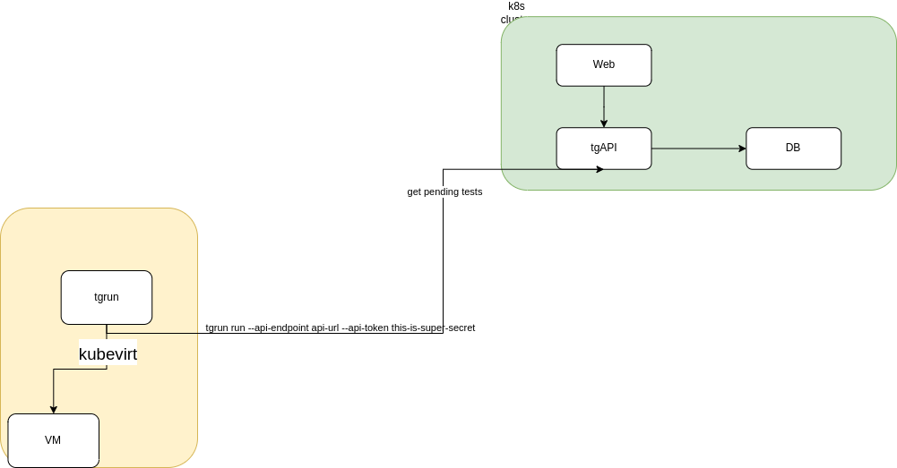
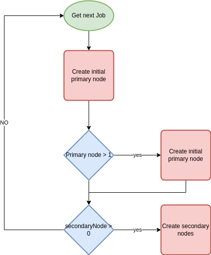
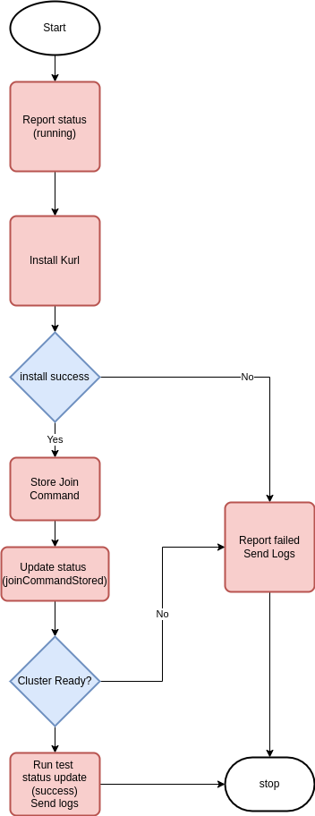
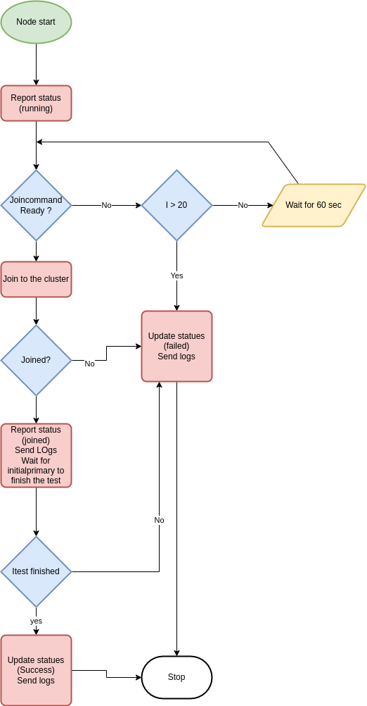

## Testgrid Components and Architecture

Testgrid has three main components.

- TGAPI: API is the main player that store and retrive the data to and from the database
- Web: is the web interface for tests
- TGrun: a daemon that polls the api for queued runs and starts new vms and tests.



# Support for multi node clusters

- Testgrid supports multi node clusters.
- You can achieve this by putting the following lines in specs file, adjusting the number of nodes as desired

```yaml
  numPrimaryNodes: 1
  numSecondaryNodes: 1
```

- The previous example will make the cluster run with one primary node and one secondary node. 


The process will be divided into three stages:
  
1. Main process before the actual node run

1. Initial primary node process

1. Normal nodes process (other primary and secondary nodes)  

## Main process

- The following chart explains what happens in the main process:



## InitPrimary node

The primary node can be in any one of the following statuses:

1. `running` when the VMI start

1. `JoincommandStored` when it does store the join command

1. `Success` when the test run successfully 

1. `Failed` when any steps during the test fail

The following chart explains what happens in the initial primary node:



## Additional Nodes Flowchart

Additional nodes can be in the following status:

1. `Running` when the VMI starts

1. `WaitingJoinCommand` when waiting on the process to start

1. `Joined` When the node is joined successfully to the cluster

1. `Success` when the test runs successfully and the initial primary node finishes the test

1. `failed` when it fails to run any step

The following chart explains what happens in the normal node (secondary and normal primary nodes):


